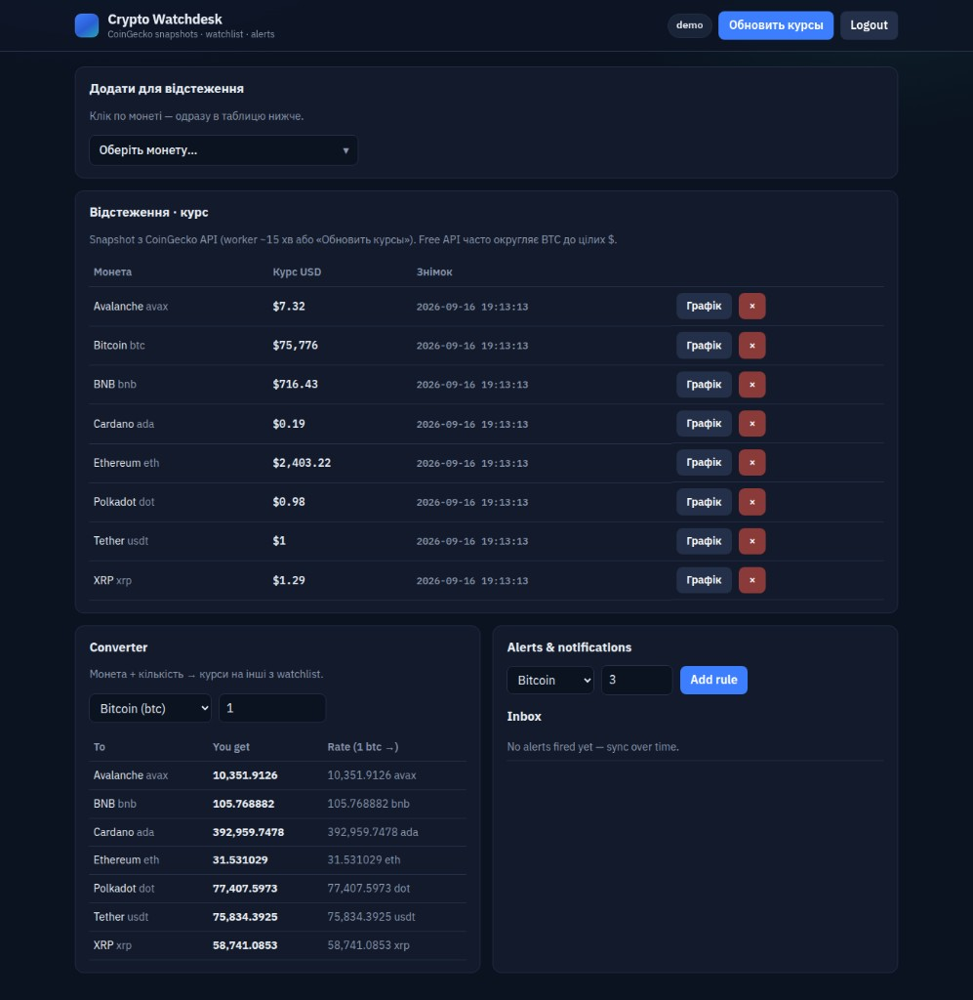
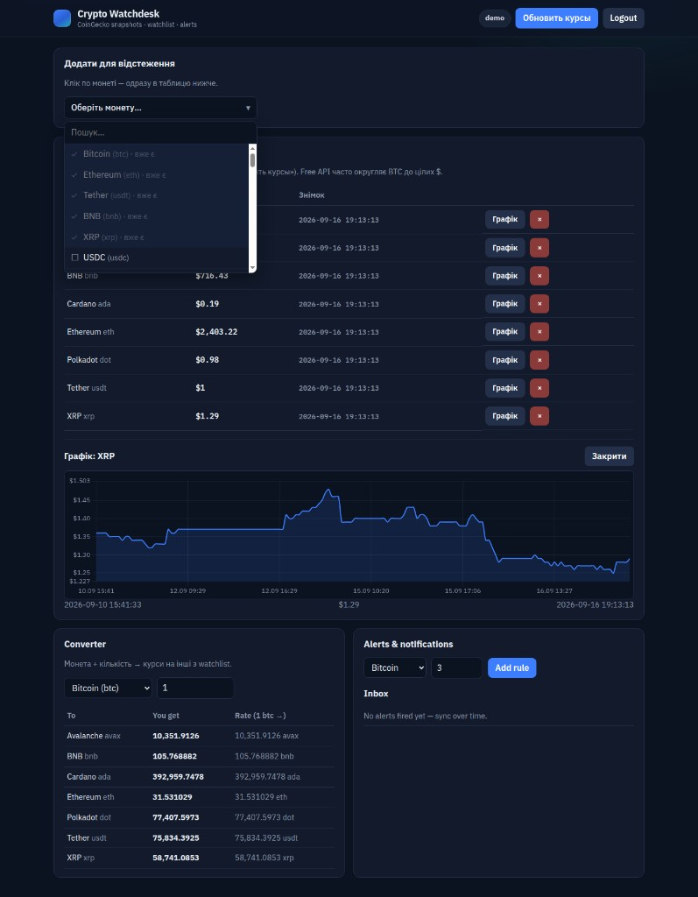

# crypto-watchdesk

[](https://github.com/thebestcreativstudio/crypto-watchdesk/actions/workflows/ci.yml)

Демо крипто-кабинета для портфолио: API на **Yii2**, интерфейс на **Vue**, всё поднимается **Docker Compose**.

Кабинет берёт курсы с **CoinGecko**, кладёт снимки в **MySQL** и уже по своей базе считает дельты, необычный объём, конвертер и алерты. Логин обычный (`demo` / `demo1234`), Google OAuth нет.

Когда воркер обновил цены, событие уходит в **Redis Stream**, **Centrifugo** пушит в браузер по **WebSocket**. Отдельный Node для сокетов не нужен.





---

## Запуск

```bash
cd crypto-watchdesk
cp .env.example .env
docker compose up -d --build
cd frontend && npm install && npm run build && cd ..
```

| URL | Що |
|-----|-----|
| http://localhost:18100 | UI (збірка `frontend/dist`) |
| http://localhost:5173 | Vue HMR (`cd frontend && npm run dev`, Docker має бути запущений) |
| http://localhost:18101 | phpMyAdmin (`watchdesk` / `secret`) |
| http://localhost:18100/api/health | API |

**Centrifugo** в compose тримає сокети. Після sync воркер пише в **Redis Stream** (`desk:sync`), Centrifugo читає потік і пушить оновлення в браузер по WebSocket (`/connection/websocket`). Node для цього не потрібен.

**Login:** `demo` / `demo1234` → **Sync now**.

Worker кожні ~5 хв: `php yii sync/once`.

---

## Що вміє

1. Watchlist + пошук монет (CoinGecko search)  
2. Історія цін (`price_snapshot`)  
3. Δ% vs ~24h (з **твоєї** БД)  
4. **Unusual volume** vs середнє останніх snapshots  
5. **Converter** — монета A + qty → монета B  
6. Alert rules → inbox notifications  
7. Live-оновлення курсів: Centrifugo + Redis Stream + WebSocket (без Node)  
8. PHPUnit + GitHub Actions CI  

Читай спочатку: [docs/HOW_IT_WORKS.md](docs/HOW_IT_WORKS.md)

---

## Тести / CI

```bash
composer install
composer test
```

Workflow: `.github/workflows/ci.yml`

---

## CoinGecko ліміти

Публічний API має rate limit і вимагає **User-Agent** (уже в `CoinGeckoClient`).  
Worker за замовчуванням sync раз на **15 хв**.  
Опційно: Demo API key → `COINGECKO_API_KEY` у `.env`.

---

## License

MIT

Розробка веб додаткiв [https://botservice.biz/](https://botservice.biz/)
